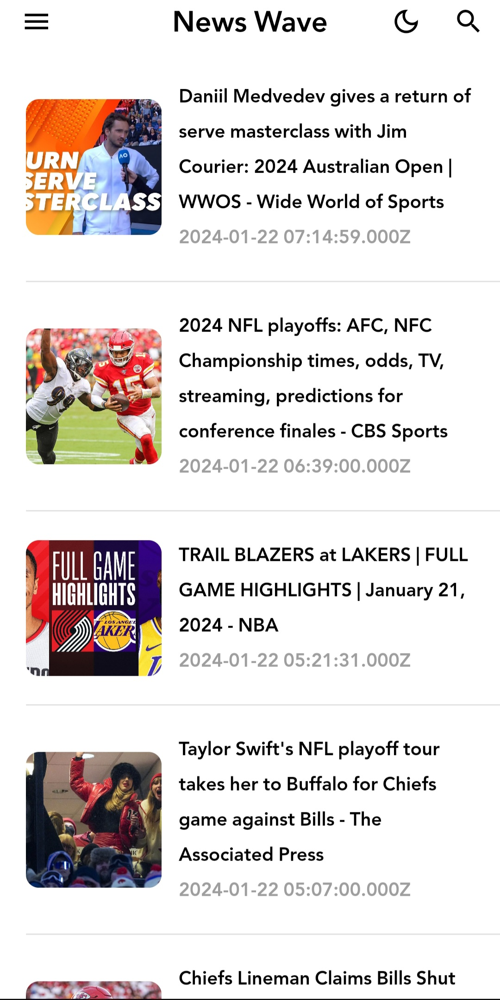
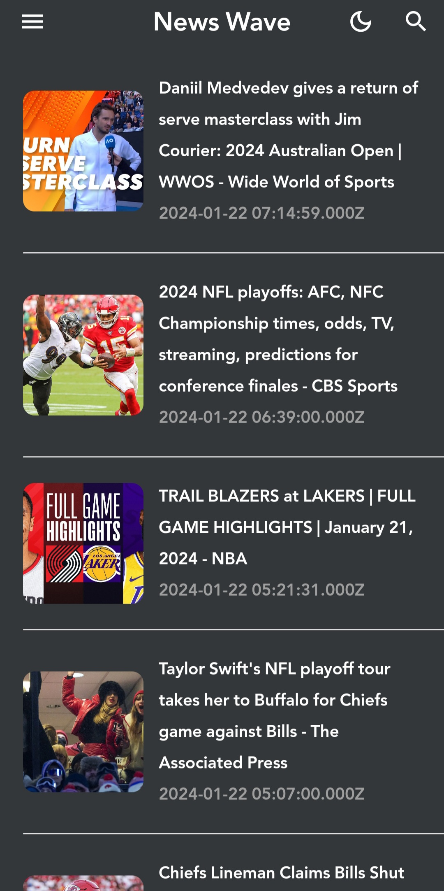
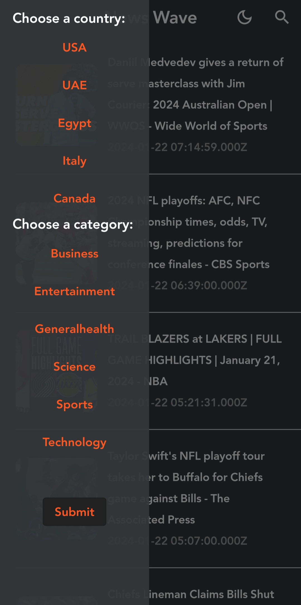

# News Wave

Introducing News Wave, a showcase news app that exemplifies both elegance and functionality in the realm of information consumption. This minimalist app is crafted specifically for my portfolio, demonstrating my prowess in designing user-centric applications with a focus on intuitive navigation and customization.

News Wave offers a streamlined experience, putting the power of information at your fingertips. With a simple tap, users can effortlessly scroll through a curated list of headlines spanning various categories such as politics, technology, sports, and entertainment. The app's sleek design ensures a clean and clutter-free interface, emphasizing the beauty of simplicity in news consumption.

One of News Wave's standout features is its dynamic customization options. Users can easily switch between news categories, tailoring their feed to match their specific interests. From global affairs to local happenings, News Wave enables users to seamlessly explore news stories that resonate with them. Additionally, the app allows users to select their city, ensuring they receive timely updates on relevant local news.

## Features

- **Effortless Headline Browsing:** Swipe through a curated list of headlines with ease.

- **Category Customization:** Tailor your news feed by choosing from a variety of categories.

- **City Selection:** Stay connected to local news by selecting your city for personalized updates.

- **Clean and Intuitive Design:** Experience news in a clutter-free environment with a minimalist interface.

## Screenshots

  

## Getting Started

To get started with the News Wave app, follow these steps:

1. **Prerequisites:** Ensure you have Flutter installed on your system. If not, you can install it from the official Flutter website.

2. **Clone the Repository:** Clone this repository to your local machine using the following command.

3. **Install Dependencies:** Navigate to the project directory and install the required dependencies.

4. **Get API Key:** visit https://newsapi.org/ and get an API Key.

5. **Run the App:** Now, you can run the app on your connected device or emulator.

## Contact

If you have any questions or suggestions regarding News Wave app, feel free to contact us at yaman.almobayed@hotmail.com
